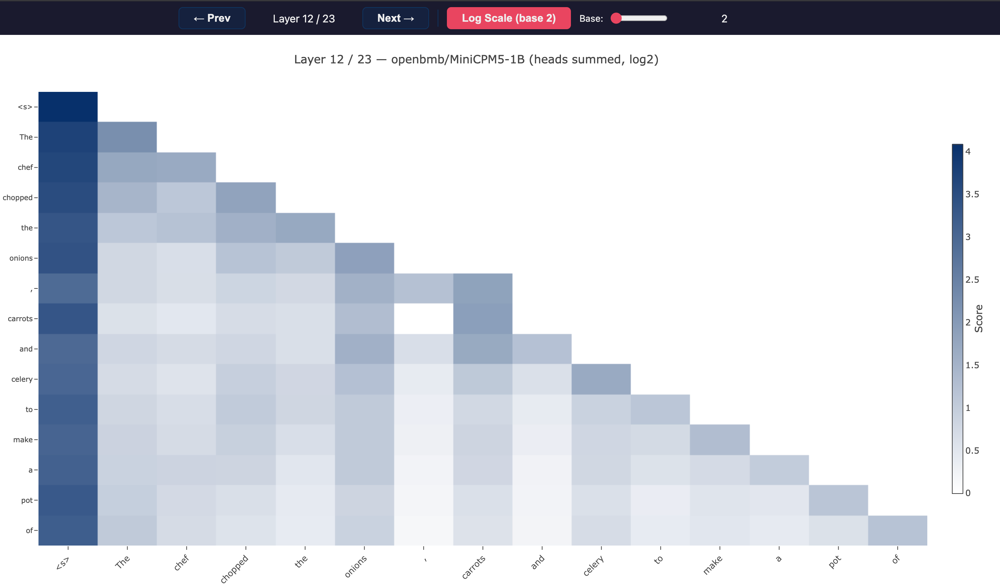

# attention-vis

Interactive attention score heatmap visualization for HuggingFace transformer models.

Runs model inference, sums attention weights across all heads per layer, and generates a standalone HTML file with interactive Plotly heatmaps.



## Install

```bash
uv sync
```

## Usage

```bash
python app.py [options]
```

### Options

| Flag | Default | Description |
|------|---------|-------------|
| `--model` | `openbmb/MiniCPM5-1B` | HuggingFace model name |
| `--prompt` | `The quick brown fox jumps over the lazy dog.` | Input text to visualize |
| `--output` | `attention.html` | Output HTML file path |
| `--device` | auto | Force device: `cpu`, `cuda`, `mps` |
| `--max-tokens` | `20` | Tokens to generate for prediction verification |
| `--no-browser` | off | Don't open browser automatically |

### Examples

```bash
# Default model and prompt
python app.py

# Custom model and prompt
python app.py --model gpt2 --prompt "Hello, world!"

# Force CPU (useful for debugging device-specific issues)
python app.py --device cpu --no-browser

# Save without opening browser
python app.py --no-browser --output my_attention.html
```

## Controls

- **← Prev / Next →** — navigate between transformer layers
- **Arrow keys** — keyboard layer navigation (←/→/↑/↓)
- **Log Scale** — toggle log-transformed attention scores (`log(v+1) / log(base)`)
- **Base slider** — adjust logarithm base (2–10, default 2)

## Known Issues

- **Phi-3.5-mini-instruct** and some other models ship with custom `modeling_*.py` files targeting older `transformers` versions. If generation produces repetitive garbage and all layers show identical attention statistics, the model is incompatible with your installed `transformers` version. Use a verified model like `openbmb/MiniCPM5-1B` or downgrade `transformers` to the model's recommended version.

## Device Support

- **CUDA** — auto-detected, uses `float16`
- **MPS (Apple Silicon)** — auto-detected, uses `float16`
- **CPU** — fallback, uses `float32`