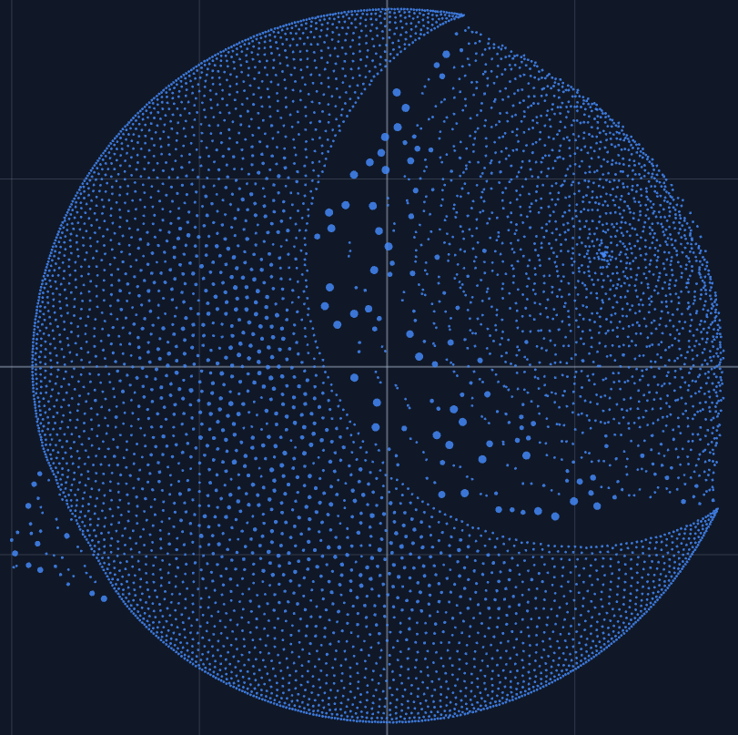
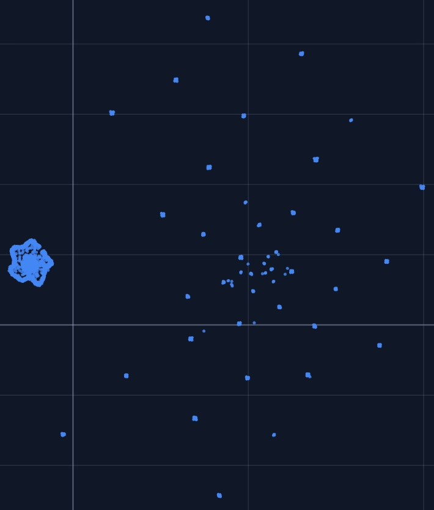
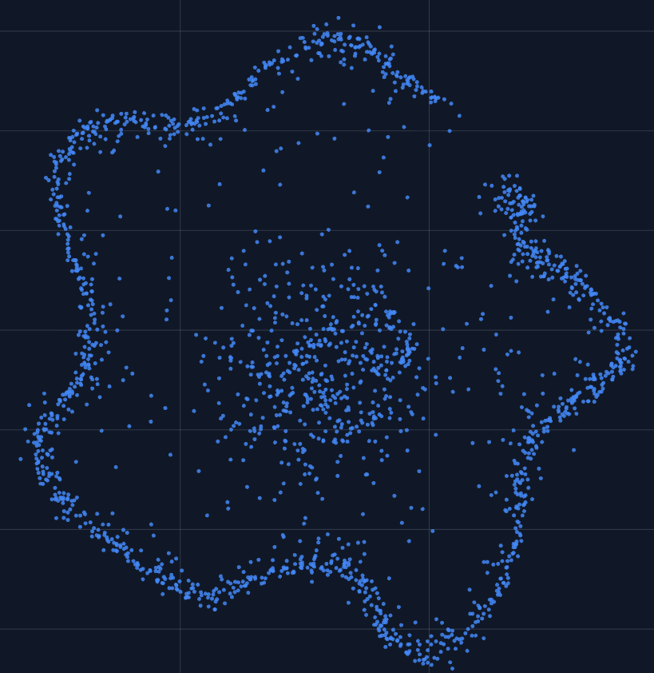

# embedding-vis

Interactive 2D and 3D embedding visualizer for LLM vectors, with UMAP and torch-backed MDS reduction plus built-in token search and regex filtering in the exported HTML.

## Stack

- `uv` for environment and dependency management
- `transformers` to load the model input embedding layer
- `umap-learn` for UMAP reduction
- `torch` for model loading and accelerated metric MDS optimization with automatic device selection
- `plotly` to render interactive 2D and 3D point clouds with hover text and client-side filtering

The reduction pipeline intentionally leaves a PCA hook in place, but PCA is not enabled yet.

## Setup

```bash
uv sync
```

## Basic usage

```bash
uv run embedding-vis umap --model bert-base-uncased --output embedding_vis.html
```

This loads the selected model's input embedding table, samples up to `--max-points` rows from it, runs the chosen reduction method in the selected dimensionality, and writes an interactive Plotly HTML visualization. By default it uses the first `--max-points` rows, but you can switch to reproducible random sampling with `--sampling-mode random`.

For torch-backed MDS instead of UMAP:

```bash
uv run embedding-vis mds --model bert-base-uncased --output embedding_vis_mds.html
```

For a 2D view:

```bash
uv run embedding-vis umap --model bert-base-uncased --dimensions 2 --output embedding_vis_2d.html
```

For a random sample instead of the first rows:

```bash
uv run embedding-vis umap --model bert-base-uncased --max-points 512 --sampling-mode random --seed 42 --output embedding_vis_random.html
```

To pre-filter tokens with a regex before reduction:

```bash
uv run embedding-vis umap --model bert-base-uncased --token-regex "^[A-Za-z]+$" --max-points 512 --output embedding_vis_regex.html
```

To force-include specific tokens (even if they exceed `--max-points`):

```bash
uv run embedding-vis umap --model bert-base-uncased --max-points 128 --include "^\\[CLS\\]$|^\\[SEP\\]$" --output embedding_vis_include.html
```

## Loading extra vectors from a `.pt` file

You can append extra vectors before reduction:

```bash
uv run embedding-vis \
  umap \
  --model bert-base-uncased \
  --extra-vectors extra_vectors.pt \
  --output embedding_vis.html
```

Supported `.pt` payload shapes:

1. A tensor of shape `[num_points, hidden_size]`
2. A dictionary with:
   - `vectors`: tensor/array-like `[num_points, hidden_size]`
   - `texts`: hover labels with one string per row

If your dictionary uses different keys, pass them with `--extra-vectors-key` and `--extra-labels-key`.

## Interactivity

The output is a Plotly scatter plot wrapped in a small HTML UI. In 3D mode, you can pan, orbit, and zoom the cloud directly in the browser. In 2D mode, you can pan and zoom the planar projection. Hovering a point shows its corresponding text. Model embedding rows use the tokenizer token as hover text, and extra vectors use the labels loaded from the `.pt` payload.

The `mds` subcommand uses a torch-native metric MDS implementation (stress minimization) that automatically prefers `cuda`, then `mps`, then `cpu` when `--device auto` is used.

It reports both raw stress and normalized stress during optimization.

The exported page also includes:

- a live search bar for tokens and labels
- an optional regex mode toggle for pattern-based filtering
- a clear button and a live match counter

Filtering is entirely client-side, so it works directly from the saved HTML file.

## Useful options

- subcommands: `umap` for the existing UMAP workflow, `mds` for torch-backed metric multidimensional scaling with the same visualization output
- `--max-points`: limit how many model embedding rows are sampled
- `--sampling-mode`: choose `top` for the first rows or `random` for a reproducible random sample using `--seed`
- `--token-regex`: optional regex filter applied to decoded token text before sampling
- `--include`: force-include tokens matching regex in the final collected model-token set
- `--dimensions`: choose `2` for a planar projection or `3` for the existing 3D view
- `--neighbors`: UMAP-only `n_neighbors`
- `--min-dist`: UMAP-only `min_dist`
- `--metric`: distance metric for the selected reducer, default `cosine`
- `--device`: for `mds`, choose `auto` (default), `cuda`, `mps`, or `cpu`
- `--mds-max-iter`: metric MDS optimization iteration cap (MDS only)
- `--mds-lr`: metric MDS learning rate (MDS only)
- `--mds-tol`: metric MDS early-stop tolerance (MDS only)
- `--radius-scale`: scale dynamic point sizes in the rendered scene
- `--initial-zoom`: control the initial Plotly camera distance in 3D mode

# Examples
```bash
uv run embedding-vis mds --model Qwen/Qwen3.5-2B --max-points 6000 --dimensions 2 --output sample_embedding_vis_mds.html --mds-max-iter 3000 --sampling-mode random --seed 114514 --mds-lr 0.1
```
See `example_qwen_dms.html`.


```bash
uv run embedding-vis umap --model Qwen/Qwen3.5-2B --max-points 6000 --dimensions 2 --output sample_embedding_vis_mds.html --sampling-mode random --seed 114514
```
See `example_qwen_umap.html`.


